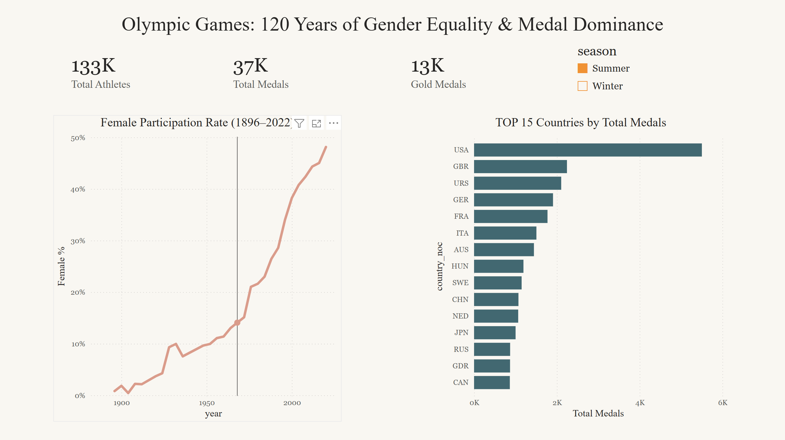
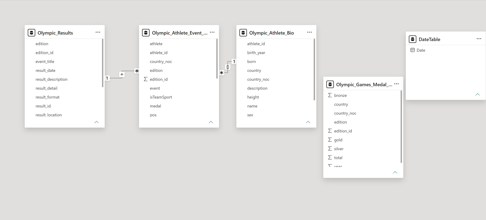
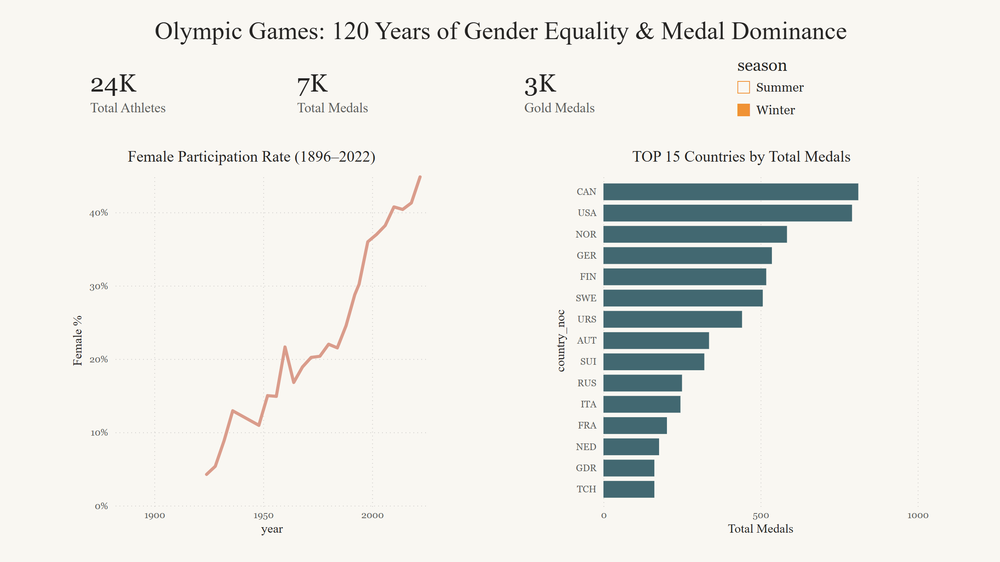
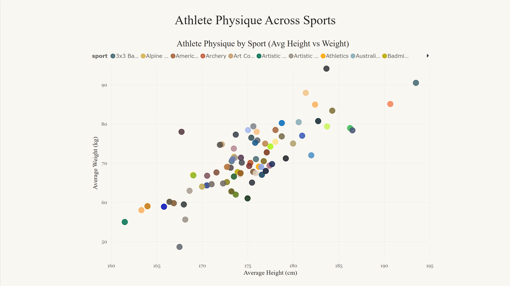
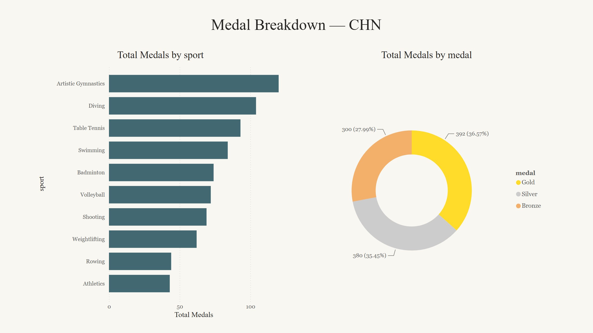
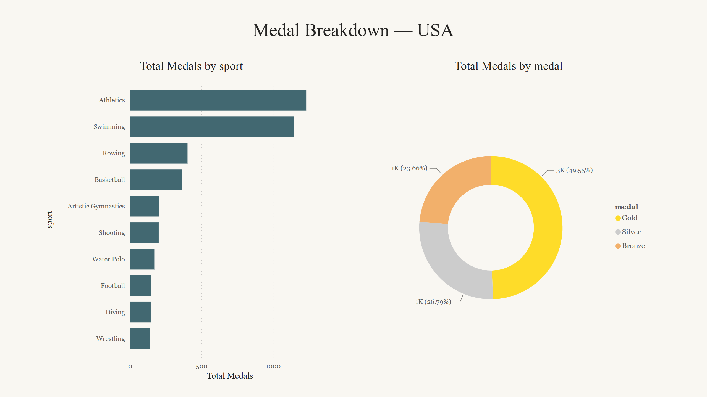
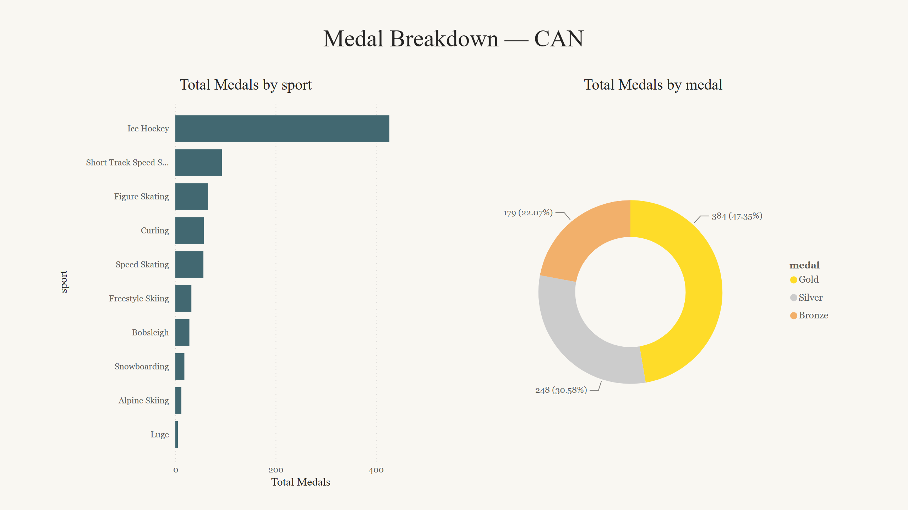

# Olympic Games: 120 Years of Gender Equality & Medal Dominance

An interactive Power BI dashboard analyzing 120+ years of Olympic data (1896–2022), tracing the rise of female participation, mapping national medal dominance, and exploring how athlete physiques differ across sports.

**Tools:** Power BI Desktop · Power Query · DAX · Data Modeling (star schema)

---

## 🎬 Demo

[](https://github.com/miniyanyan/olympic-powerbi/blob/main/dashboard_demo.mp4)

▶ **[Watch the drill-through demo](https://github.com/miniyanyan/olympic-powerbi/blob/main/dashboard_demo.mp4)** — click the image above or the link to play `dashboard_demo.mp4` in GitHub's built-in video player.

---

## 📊 Overview

This project turns a multi-table, athlete-level dataset (300K+ event records) into a story-driven, three-page dashboard built around three questions:

1. **How has gender equality at the Olympics evolved over time?**
2. **Which countries dominate the medal table, and how does that shift between Summer and Winter Games?**
3. **How do athlete body types vary across sports?**

The goal wasn't just to visualize data, but to build a clean end-to-end pipeline — ingest → clean → model → measure → present → drill through — and to debug the real problems that surfaced along the way.

---

## 🗂️ Dataset

**Source:** [Olympic Historical Dataset from Olympedia.org](https://www.kaggle.com/datasets/josephcheng123456/olympic-historical-dataset-from-olympediaorg) (Kaggle)

Scraped from olympedia.org, covering the 1896 Athens Summer Games through the 2022 Beijing Winter Games, across ~235 national committees. A genuinely **multi-table** dataset — ideal for practicing real data modeling.

| File | Role | Key fields |
|------|------|-----------|
| `Olympic_Athlete_Event_Results.csv` | Fact table (event-athlete results) | athlete_id, result_id, medal, sport, country_noc |
| `Olympic_Athlete_Bio.csv` | Dimension (athlete biography) | athlete_id, sex, born, height, weight, country_noc |
| `Olympic_Results.csv` | Dimension (event details) | result_id, edition, sport |
| `Olympic_Games_Medal_Tally.csv` | Validation (national medal totals) | used to cross-check aggregations |

---

## 🔧 1. Data Cleaning (Power Query)

Every transformation is recorded as an applied step for full reproducibility. The dataset had several real-world quality issues worth handling explicitly:

- **`born` field mixes formats** — some rows are full dates (`6 November 1991`), others are year-only (`1914`). Rather than forcing a date type (which would error on the whole column), I extracted the trailing 4-digit **birth year** into a clean integer column.
- **`height` / `weight` stored as text** with non-numeric values mixed in. Converting in the report view failed outright, so I converted types in Power Query and then used **Replace Errors → null**, the standard two-step pattern for messy numeric columns. Valid numbers are preserved; bad values become null and are excluded at the measure level.
- **`medal` nulls → "None"** so medal-winning status is explicit and countable. (See the debugging note below — the first attempt accidentally overwrote the whole column.)
- **`season` derived** from `edition` (`"1912 Summer Olympics"` → `Summer`/`Winter`) to power the season slicer.
- **No blind deduplication** — uniqueness is defined by `athlete_id` + `result_id`, since one athlete competing in multiple events is valid.

---

## 🏗️ 2. Data Modeling

A **star schema** with the results fact table at the center:

```
        Olympic_Athlete_Bio  (dimension)
                 │  many-to-one (athlete_id)
                 ▼
   Olympic_Athlete_Event_Results  (fact)
                 ▲
                 │  many-to-one (result_id)
        Olympic_Results  (dimension)

   Olympic_Games_Medal_Tally  (standalone, validation)

   DateTable = CALENDAR(DATE(1896,1,1), DATE(2022,12,31))
```

The medal-tally table is intentionally left unrelated — it sits at a different grain (country × edition) than the fact table (athlete × event), so joining it would introduce ambiguity. It's kept purely for validation.



---

## 🧮 3. DAX Measures

Core aggregations:

```dax
Total Medals =
COUNTROWS(FILTER('Olympic_Athlete_Event_Results',
    'Olympic_Athlete_Event_Results'[medal] <> "None"))

Gold Medals =
COUNTROWS(FILTER('Olympic_Athlete_Event_Results',
    'Olympic_Athlete_Event_Results'[medal] = "Gold"))

Total Athletes =
DISTINCTCOUNT('Olympic_Athlete_Event_Results'[athlete_id])

Female % =
DIVIDE(
    CALCULATE([Total Athletes], 'Olympic_Athlete_Bio'[sex] = "Female"),
    [Total Athletes])
```

Dynamic drill-through title — the detail page header updates to show whichever country was drilled into:

```dax
Detail Title =
"Medal Breakdown — " &
SELECTEDVALUE('Olympic_Athlete_Event_Results'[country_noc], "All Countries")
```

---

## 📈 4. The Dashboard

### Page 1 — Overview
KPI cards (total athletes, medals, gold medals), a line chart of **female participation rate over time** (the core narrative), a **Top 15 Countries by Total Medals** bar chart, and a **Season slicer** — all cross-filtered.


The season slicer reshapes the whole page. Switching to Winter swaps the leaderboard entirely:



### Page 2 — Athlete Physique
A scatter plot of **average height vs. average weight by sport**, revealing a clear positive correlation and distinct clusters (tall/heavy sports like rowing and basketball vs. compact sports like gymnastics).



### Page 3 — Country Detail (Drill-through)
Right-click any country on Page 1 → **Drill through** → a dedicated detail page showing that country's medals by sport and its gold/silver/bronze breakdown (colored to match the medals themselves). A **dynamic title** built with `SELECTEDVALUE` updates to name the selected country.





The drill-through respects the season context too — here's a country's Winter-only breakdown:



---

## 🐞 Debugging Notes (the interesting part)

Several real problems surfaced and were diagnosed and fixed:

1. **Gold Medals equalled Total Medals.** The original measure wrapped `[Total Medals]` in `CALCULATE` with a medal filter, but the inner `CALCULATE` *overrode* the outer filter context. Verified the bug by running a DAX query comparing the measure against a direct `COUNTROWS` filter, then rewrote both measures using `FILTER` so the filters stack correctly.

2. **Scatter plot collapsed to a single point.** `sport` (fact table) couldn't slice `height`/`weight` (bio table) because the relationship's cross-filter direction was single. A `SUMMARIZECOLUMNS` query confirmed every sport returned identical averages; setting the bio-to-fact relationship to **bi-directional** fixed it.

3. **Drill-through wouldn't trigger.** Resolved by ensuring the drill-through field and the source visual's field came from the same table, and by right-clicking the data point (the bar) rather than the visual background.

4. **A bad `medal` replacement** initially overwrote the whole column with "None." Caught it by listing distinct values via a DAX query, reverted the step, and used a safer replacement approach.

---

## 💡 Key Insights

- Female participation rose from **under 2%** in the early Games to roughly **45–50%** in recent editions.
- Medal dominance concentrates in a handful of nations, and the leaderboard reshuffles entirely between Summer (USA, GBR, URS) and Winter (CAN, NOR, GER) Games.
- Athlete physique clusters tightly by sport — a clean, interpretable signal.

---

## 🚀 How to Run

1. Install [Power BI Desktop](https://powerbi.microsoft.com/desktop/) (free, Windows only).
2. Download the dataset from Kaggle and place the CSVs in a `/data` folder.
3. Open `olympic-powerbi-dashboard.pbix`.
4. If paths differ, update them under **Transform data → Data source settings**.

---

## 📁 Repository Structure

```
olympic-powerbi/
├── data/                            # raw Kaggle CSVs (gitignored — download separately)
├── function_screenshot/
│   ├── overview.png
│   ├── overview_winter.png
│   ├── athlete_physique.png
│   ├── data_model.png
│   ├── country_detail1.png
│   ├── country_detail2.png
│   └── country_detail_winter.png
├── dashboard_demo.mp4
├── olympic-powerbi-dashboard.pbix
└── README.md
```

---

## 🔭 Possible Extensions

- Add time-intelligence comparisons between consecutive Games.
- Analyze a host-nation advantage effect.
- Cross-validate fact-table aggregations against the medal-tally table.
- Publish to Power BI Service for live interactivity.
